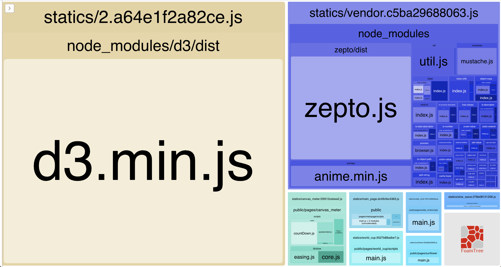

# [WebLab](https://suxin1.github.io/WebLab/apps/build/)
Experimentation of the of the modern web :)

* [用Canvas制作仪表动画](https://suxin1.github.io/WebLab/apps/build/canvas_meter.html)

### 项目运行与编译
```bash
# 项目所有代码均在 apps 目录下
cd apps

# 第一次需要安装相应依赖
npm install

# 运行开发环境
npm start

# 生成生产代码（编译）
npm run build
```

### 打包构建方案
项目使用webpack打包构建，babel7预编译js（可以尽情使用ES6和ES7型特性），sass样式模块化

#### 尝试解决的问题
 * JQuery, Zepto, D3等公共库动态加载
 * 模块化 (AMD/CommonJS/UMD/ES6 Module)
 * 资源持久化缓存(Caching with hashing)

#### 解决方案:

 * 公共库动态加载: 用ES6新的动态加载 import().then()。
   webpack4 Code Splitting: https://webpack.js.org/guides/code-splitting/

 * 模块化:
  使用 ES6 Module 的 `import *** from ***` 导入模块化代码;
  使用 ES6 的异步加载方式 `import()` 加载共享模块和公共库;

 * 持久化缓存:
   使用文件hash值作为资源文件名的一部分，并用 HtmlWebpackPlugin 注入所需资源。

#### 注意事项 !!!
 * 每个页面都有一个 EntryPoint, 在 EntryFile 里面导入需要的CSS。
 * 想要在多页面下为每个页面注入所依赖的资源，需要配置多个HtmlWebpackPlugin。
 * 使用 HtmlWebpackPlugin 注入依赖会将所有Bundle文件注入HTML模板，这当然不是我们想看见的，所以需要在每一个HtmlWebpackPlugin配置里面加上属性`chunks`.
 * 如果需要引入处在打包流程以外的文件，可以配置 CopyWebpackPlugin，将该文件复制到build文件夹，并在HTML模板里添加引用。如果用的是CDN加载，可以配置 externals 属性。
 * 当引用 node_module 下的库时，该库会被打包到 vendor bundle文件里面，如果引用的第三方库太多会导致vendor bundle文件过于臃肿。用动态加载会给引用库生成一个单独的文件生成一个单独的文件。
 * 使用 ES6 Module 中的 import() 实现按需加载。
 * 请不要在模块文件中尝试动态引用，所有动态引用只应存在于entry文件。当某第三方库需要动态引用时（减小vendor bundle的size）又需要在模块文件中使用该库，可以在entry文件中将该库挂载到全局环境。
 
 
 ### 包文件分析
 用 webpack-bundle-analyzer 生成Treemap来分析打包后的文件。
 下图是本项目某时间打包时生成的Treemap。这张图很好的呈现了打包后的文件大小，所包含库等有用的信息，方便后期更深入的优化。
  
